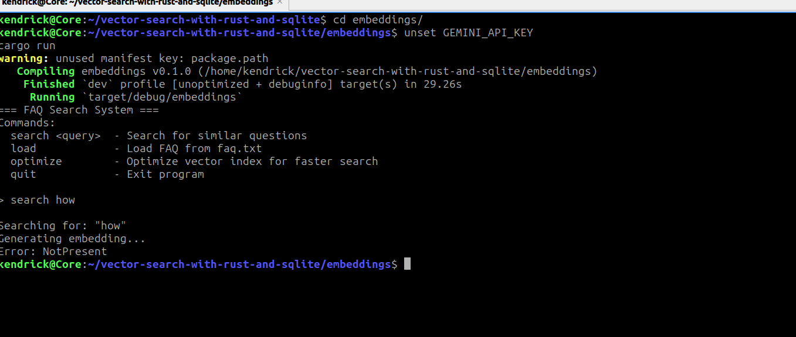

# Refactoring

In the last chapter we managed to cobble up something working from scratch, but
it's not enough to just work — we must make it better.

In this chapter, we're going to poke some holes in our previous setup and look
at how we can make it more secure and robust.

Let's start with error handling. As of now, every little error crashes our program
and the error messages returned are quite vague.

We used
```rust
Result<T, Box<dyn std::error::Error>>
```

to propagate errors upwards from each of our functions. This is convenient, but
it collapses every error into one generic, vague type which offers little
information. For example, if we have a missing API key in our environment
variables, the program exits with a generic error message as shown below:



Looking at our setup we can identify several distinct boundaries which might fail:

- **IO** — reading the FAQ might fail due to a missing file or missing permissions
- **Network** — to transform each of our texts to vectors we make an HTTP request to the Gemini API
- **Database** — database operations might fail due to a missing database or missing permissions
- **Env** — our API key for Gemini is read from environment variables
- **Parse** — the FAQ file or Gemini API response might not match the expected format

To make our program better we need to provide explicit error messages at each of
these boundaries. We do this by defining a custom error type:
```rust
{{#include ../embeddings/src/errors.rs}}
```

We explicitly define an enum whose variants each wrap a specific error type,
giving us precise information about what went wrong and where. The `impl_from!`
macro derives `From` trait implementations for each variant, allowing the `?`
operator to automatically convert errors into the appropriate `AppError` variant
without any manual casting.

What's left is to replace every `Box<dyn std::error::Error>` in our codebase
with `AppError`. We also take this opportunity to move our embedding logic into
`lib.rs`, separating it from the entry point:
```rust
{{#include ../embeddings/src/types.rs}}
```
```rust
{{#include ../embeddings/src/lib.rs}}
```

`main.rs` is now responsible for one thing — running the program and surfacing
any errors to the user via `Display`, rather than letting Rust's default `Debug`
output bypass our custom messages:
```rust
{{#include ../embeddings/src/main.rs}}
```